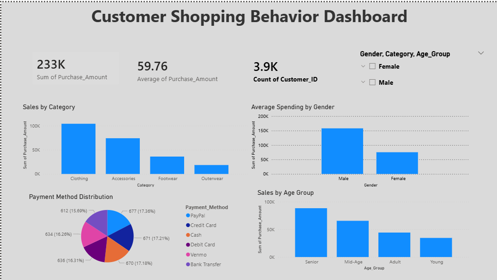

# Customer Shopping Behavior Analysis

## 📊 Project Overview
This project analyzes customer shopping behavior to identify purchasing patterns, customer segments, and business insights.

## 🛠 Tools Used
- Python (Pandas, Matplotlib)
- SQL (MySQL)
- Excel (Data Cleaning)
- Power BI (Dashboard)

## 📈 Key Insights
- Identified top-performing product categories
- Analyzed spending patterns across age groups and gender
- Evaluated customer payment preferences
- Discovered high-value customer segments

## 📊 Dashboard Preview

## 📊 Dashboard Features
- KPI metrics: Total Revenue, Average Purchase, Total Customers
- Sales analysis by category, gender, and age group
- Payment method distribution
- Interactive filters for better insights

## 🚀 Outcome
Built an end-to-end data analysis pipeline from raw data to interactive dashboard for business decision-making.
